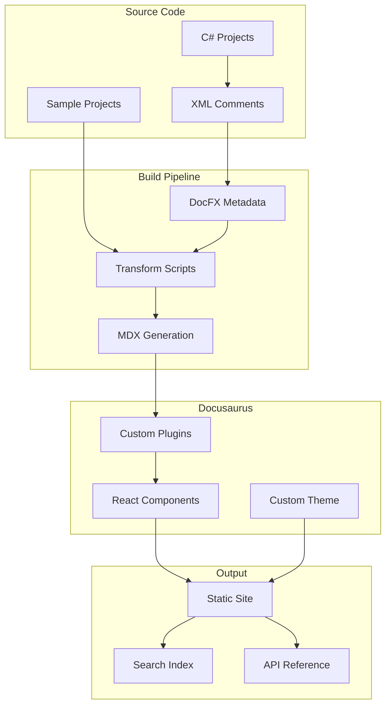

# Technical Architecture

This section details the technical design decisions for the SimpleMessageBus documentation site implementation.

## Overview

The documentation site architecture is designed to:
- Automatically generate API documentation from C# XML comments
- Provide an intuitive navigation structure
- Support interactive code examples and playgrounds
- Scale with the SimpleMessageBus project growth
- Maintain consistency with learn.microsoft.com aesthetics

## Architecture Components

1. **[Site Structure](site-structure.md)** - Information architecture and navigation design
2. **[Component Design](component-design.md)** - Custom React components for documentation
3. **[Search Implementation](search-implementation.md)** - Search strategy and configuration
4. **[Versioning Strategy](versioning-strategy.md)** - Multi-version documentation approach
5. **[Integration Requirements](integration-requirements.md)** - C# documentation pipeline

## High-Level Architecture

## Key Design Decisions

### 1. Static Site Generation
- **Decision**: Use static site generation vs dynamic rendering
- **Rationale**: Better performance, SEO, and hosting simplicity
- **Trade-offs**: Build time vs runtime flexibility

### 2. React Component Architecture
- **Decision**: Create custom React components for API documentation
- **Rationale**: Maximum flexibility and consistency
- **Trade-offs**: Development effort vs using existing solutions

### 3. Search Strategy
- **Decision**: Algolia DocSearch for primary search
- **Rationale**: Best-in-class search experience
- **Trade-offs**: External dependency vs local search

### 4. Build Pipeline
- **Decision**: Two-stage build (DocFX → Docusaurus)
- **Rationale**: Leverage DocFX's C# expertise
- **Trade-offs**: Build complexity vs native integration

## Technical Stack

### Frontend
- **Framework**: React 18+
- **Bundler**: Webpack 5 (via Docusaurus)
- **Language**: TypeScript
- **Styling**: CSS Modules + Custom CSS
- **Components**: MDX + Custom React

### Build Tools
- **Site Generator**: Docusaurus 3.x
- **API Extractor**: DocFX 2.x
- **Scripting**: Node.js 18+
- **Package Manager**: npm 9+

### Infrastructure
- **Hosting**: GitHub Pages / Azure Static Web Apps
- **CDN**: Cloudflare (optional)
- **Search**: Algolia
- **Analytics**: Google Analytics 4
- **Monitoring**: GitHub Insights

## Performance Targets

- **Build Time**: <5 minutes for full rebuild
- **Incremental Build**: <1 minute
- **Page Load**: <2 seconds on 3G
- **Search Response**: <200ms
- **Lighthouse Score**: >90 all categories

## Security Considerations

- **Static Content**: No server-side vulnerabilities
- **CSP Headers**: Strict content security policy
- **HTTPS Only**: Enforce secure connections
- **Dependency Scanning**: Automated vulnerability checks
- **Access Control**: Public documentation only

## Scalability Design

- **Modular Architecture**: Easy to add new sections
- **Automated Generation**: Scales with codebase
- **CDN Distribution**: Global performance
- **Incremental Builds**: Fast updates
- **Version Branching**: Parallel version support

## Maintenance Strategy

- **Automated Updates**: CI/CD pipeline
- **Content Validation**: Link checking, spell check
- **Version Cleanup**: Automated old version removal
- **Monitoring**: Performance and error tracking
- **Backup Strategy**: Git-based recovery