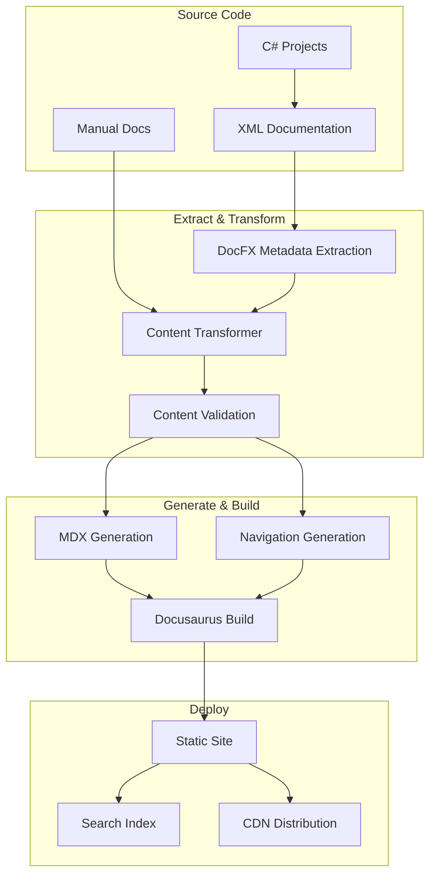

# Integration Requirements

## Overview

This document outlines the technical requirements for integrating C# XML documentation with the Docusaurus-based documentation site, including build pipeline, content transformation, and automation requirements.

## Build Pipeline Architecture

### High-Level Flow



## Phase 1: DocFX Integration

### DocFX Configuration

```json
{
  "metadata": [
    {
      "src": [
        {
          "files": [
            "src/SimpleMessageBus.Core/**/*.cs",
            "src/SimpleMessageBus.Publish/**/*.cs",
            "src/SimpleMessageBus.Dispatch/**/*.cs",
            "src/SimpleMessageBus.Hosting/**/*.cs",
            "src/SimpleMessageBus.*.Core/**/*.cs"
          ],
          "exclude": [
            "**/bin/**",
            "**/obj/**",
            "**/Templates/**",
            "**/Samples/**",
            "**/Tests/**",
            "**/Tools/**"
          ]
        }
      ],
      "dest": "api-metadata",
      "disableGitFeatures": false,
      "disableDefaultFilter": false,
      "includePrivateMembers": false,
      "properties": {
        "TargetFramework": "net8.0"
      },
      "filter": "filterConfig.yml"
    }
  ],
  "build": {
    "content": [
      {
        "files": [
          "api-metadata/*.yml",
          "api-metadata/.manifest"
        ]
      }
    ],
    "resource": [
      {
        "files": [
          "images/**"
        ]
      }
    ],
    "output": "_site",
    "template": [
      "modern"
    ],
    "globalMetadata": {
      "_appTitle": "SimpleMessageBus API Reference",
      "_appFooter": "SimpleMessageBus Documentation",
      "_enableSearch": true,
      "_enableNewTab": true
    }
  }
}
```

### Filter Configuration

```yaml
# filterConfig.yml
apiRules:
- include:
    uidRegex: ^SimpleMessageBus\.
- exclude:
    uidRegex: ^SimpleMessageBus\..*\.Internal\.
- exclude:
    uidRegex: ^SimpleMessageBus\.Tests\.
- exclude:
    uidRegex: ^SimpleMessageBus\.Samples\.
- exclude:
    uidRegex: ^SimpleMessageBus\.Templates\.
- exclude:
    uidRegex: ^SimpleMessageBus\.Tools\.
- include:
    hasAttribute:
      uid: System.ComponentModel.EditorBrowsableAttribute
      ctorArguments:
      - System.ComponentModel.EditorBrowsableState.Never
```

## Phase 2: Content Transformation

### Metadata Parser

```javascript
// scripts/metadata-parser.js
const yaml = require('js-yaml');
const fs = require('fs').promises;
const path = require('path');

class MetadataParser {
  constructor(metadataPath) {
    this.metadataPath = metadataPath;
    this.metadata = new Map();
  }

  async parse() {
    const manifestPath = path.join(this.metadataPath, '.manifest');
    const manifest = JSON.parse(await fs.readFile(manifestPath, 'utf8'));
    
    for (const file of manifest.files) {
      if (file.type === 'ManagedReference') {
        const content = await fs.readFile(
          path.join(this.metadataPath, file.output), 
          'utf8'
        );
        const items = yaml.load(content);
        
        for (const item of items.items) {
          this.metadata.set(item.uid, item);
        }
      }
    }
    
    return this.metadata;
  }

  getNamespace(uid) {
    return uid.split('.').slice(0, -1).join('.');
  }

  getTypeName(uid) {
    return uid.split('.').pop();
  }

  getInheritanceChain(item) {
    const chain = [];
    let current = item;
    
    while (current && current.inheritance) {
      for (const parent of current.inheritance) {
        const parentItem = this.metadata.get(parent);
        if (parentItem) {
          chain.push(parentItem);
          current = parentItem;
        }
      }
    }
    
    return chain;
  }

  getImplementedInterfaces(item) {
    if (!item.implements) return [];
    
    return item.implements
      .map(uid => this.metadata.get(uid))
      .filter(Boolean);
  }
}

module.exports = MetadataParser;
```

### MDX Generator

```javascript
// scripts/mdx-generator.js
const MetadataParser = require('./metadata-parser');
const MarkdownGenerator = require('./markdown-generator');

class MDXGenerator {
  constructor(options) {
    this.options = options;
    this.parser = new MetadataParser(options.metadataPath);
    this.markdownGen = new MarkdownGenerator();
  }

  async generate() {
    const metadata = await this.parser.parse();
    const generatedFiles = [];
    
    // Group by namespace
    const namespaces = this.groupByNamespace(metadata);
    
    for (const [namespace, items] of namespaces) {
      await this.generateNamespace(namespace, items);
      generatedFiles.push(`${namespace}/index.mdx`);
      
      for (const item of items) {
        const filePath = await this.generateItem(item);
        generatedFiles.push(filePath);
      }
    }
    
    // Generate navigation
    await this.generateNavigation(namespaces);
    
    return generatedFiles;
  }

  async generateItem(item) {
    const content = this.createMDXContent(item);
    const fileName = this.getFileName(item);
    const filePath = path.join(this.options.outputPath, fileName);
    
    await fs.writeFile(filePath, content, 'utf8');
    return fileName;
  }

  createMDXContent(item) {
    const frontmatter = this.createFrontmatter(item);
    const imports = this.createImports(item);
    const content = this.createContent(item);
    
    return `---
${yaml.dump(frontmatter)}---

${imports}

${content}`;
  }

  createFrontmatter(item) {
    return {
      title: item.name,
      description: this.extractSummary(item.summary),
      keywords: this.extractKeywords(item),
      sidebar_position: this.getSidebarPosition(item),
      custom_edit_url: this.getEditUrl(item),
    };
  }

  createImports(item) {
    return `import ApiReference from '@site/src/components/ApiReference';
import CodeExample from '@site/src/components/CodeExample';
import Tabs from '@theme/Tabs';
import TabItem from '@theme/TabItem';`;
  }

  createContent(item) {
    const sections = [
      this.createHeader(item),
      this.createSummary(item),
      this.createSyntax(item),
      this.createParameters(item),
      this.createReturns(item),
      this.createExamples(item),
      this.createRemarks(item),
      this.createSeeAlso(item),
      this.createInheritance(item),
      this.createMembers(item)
    ].filter(Boolean);
    
    return sections.join('\n\n');
  }

  createHeader(item) {
    const namespace = this.parser.getNamespace(item.uid);
    const typeName = this.parser.getTypeName(item.uid);
    
    return `<ApiReference
  type="${item.type}"
  name="${typeName}"
  namespace="${namespace}"
  fullName="${item.uid}"
  assembly="${item.assemblies?.[0]}"
/>`;
  }

  createSyntax(item) {
    if (!item.syntax) return '';
    
    return `## Syntax

\`\`\`csharp
${item.syntax.content}
\`\`\``;
  }

  createParameters(item) {
    if (!item.syntax?.parameters) return '';
    
    const paramTable = item.syntax.parameters
      .map(p => `| \`${p.id}\` | \`${p.type}\` | ${p.description || ''} |`)
      .join('\n');
    
    return `## Parameters

| Name | Type | Description |
|------|------|-------------|
${paramTable}`;
  }

  createExamples(item) {
    if (!item.example) return '';
    
    // Extract code examples from XML documentation
    const examples = this.parseExamples(item.example);
    
    return examples.map(example => `
<CodeExample title="${example.title}">

\`\`\`csharp
${example.code}
\`\`\`

${example.description}

</CodeExample>`).join('\n');
  }
}
```

### Navigation Generator

```javascript
// scripts/navigation-generator.js
class NavigationGenerator {
  constructor(metadata) {
    this.metadata = metadata;
  }

  generateSidebar() {
    const sidebar = {
      apiSidebar: [
        {
          type: 'category',
          label: 'Getting Started',
          items: ['api/overview', 'api/quick-start']
        }
      ]
    };

    // Group by namespace
    const namespaces = this.groupByNamespace();
    
    for (const [namespace, items] of namespaces) {
      const category = {
        type: 'category',
        label: this.getNamespaceDisplayName(namespace),
        items: [
          `api/${namespace}/index`,
          ...this.generateNamespaceItems(namespace, items)
        ]
      };
      
      sidebar.apiSidebar.push(category);
    }

    return sidebar;
  }

  generateNamespaceItems(namespace, items) {
    // Group by type (interfaces, classes, enums, etc.)
    const grouped = {
      interfaces: [],
      classes: [],
      enums: [],
      delegates: []
    };

    for (const item of items) {
      const category = this.getItemCategory(item);
      if (grouped[category]) {
        grouped[category].push(`api/${namespace}/${item.name}`);
      }
    }

    const result = [];
    
    if (grouped.interfaces.length > 0) {
      result.push({
        type: 'category',
        label: 'Interfaces',
        items: grouped.interfaces.sort()
      });
    }

    if (grouped.classes.length > 0) {
      result.push({
        type: 'category',
        label: 'Classes',
        items: grouped.classes.sort()
      });
    }

    // Add other categories...

    return result;
  }
}
```

## Phase 3: Build Automation

### GitHub Actions Workflow

```yaml
# .github/workflows/docs.yml
name: Documentation Build and Deploy

on:
  push:
    branches: [ main, v6 ]
    paths:
      - 'src/**/*.cs'
      - 'docs/**/*'
      - '.github/workflows/docs.yml'
  pull_request:
    branches: [ main ]
    paths:
      - 'src/**/*.cs'
      - 'docs/**/*'

jobs:
  build-docs:
    runs-on: ubuntu-latest
    
    steps:
    - uses: actions/checkout@v3
      with:
        fetch-depth: 0
    
    - name: Setup .NET
      uses: actions/setup-dotnet@v3
      with:
        dotnet-version: '8.0.x'
    
    - name: Setup Node.js
      uses: actions/setup-node@v3
      with:
        node-version: '18'
        cache: 'npm'
        cache-dependency-path: docs/package-lock.json
    
    - name: Restore .NET dependencies
      run: dotnet restore
    
    - name: Build .NET projects
      run: dotnet build --no-restore --configuration Release
    
    - name: Install DocFX
      run: |
        wget https://github.com/dotnet/docfx/releases/latest/download/docfx-linux-x64.zip
        unzip docfx-linux-x64.zip -d docfx
        chmod +x docfx/docfx
        echo "${{ github.workspace }}/docfx" >> $GITHUB_PATH
    
    - name: Generate API metadata
      run: |
        cd docs
        docfx metadata docfx.json
    
    - name: Install documentation dependencies
      run: |
        cd docs
        npm ci
    
    - name: Transform API metadata
      run: |
        cd docs
        npm run transform-api
    
    - name: Build documentation site
      run: |
        cd docs
        npm run build
        
    - name: Upload build artifact
      uses: actions/upload-artifact@v3
      with:
        name: documentation-site
        path: docs/build/
    
    - name: Deploy to GitHub Pages
      if: github.ref == 'refs/heads/main'
      uses: peaceiris/actions-gh-pages@v3
      with:
        github_token: ${{ secrets.GITHUB_TOKEN }}
        publish_dir: docs/build
        cname: docs.simplemessagebus.com
```

### Package.json Scripts

```json
{
  "name": "simplemessagebus-docs",
  "scripts": {
    "docusaurus": "docusaurus",
    "start": "docusaurus start",
    "build": "npm run transform-api && docusaurus build",
    "swizzle": "docusaurus swizzle",
    "deploy": "docusaurus deploy",
    "clear": "docusaurus clear",
    "serve": "docusaurus serve",
    "write-translations": "docusaurus write-translations",
    "write-heading-ids": "docusaurus write-heading-ids",
    "transform-api": "node scripts/transform-api.js",
    "validate-content": "node scripts/validate-content.js",
    "generate-sitemap": "node scripts/generate-sitemap.js",
    "update-search": "node scripts/update-search-index.js"
  },
  "dependencies": {
    "@docusaurus/core": "^3.0.0",
    "@docusaurus/preset-classic": "^3.0.0",
    "@docsearch/react": "^3.0.0",
    "clsx": "^2.0.0",
    "prism-react-renderer": "^2.0.0",
    "react": "^18.0.0",
    "react-dom": "^18.0.0"
  },
  "devDependencies": {
    "@docusaurus/module-type-aliases": "^3.0.0",
    "@docusaurus/types": "^3.0.0",
    "js-yaml": "^4.1.0",
    "gray-matter": "^4.0.3",
    "remark": "^14.0.0",
    "remark-parse": "^10.0.0",
    "unified": "^10.0.0"
  }
}
```

## Phase 4: Content Validation

### Validation Rules

```javascript
// scripts/validators/content-validator.js
class ContentValidator {
  constructor() {
    this.rules = [
      new LinkValidator(),
      new ApiReferenceValidator(),
      new CodeExampleValidator(),
      new MetadataValidator(),
      new AccessibilityValidator()
    ];
  }

  async validate(contentPath) {
    const results = [];
    
    for (const rule of this.rules) {
      const ruleResults = await rule.validate(contentPath);
      results.push(...ruleResults);
    }
    
    return results;
  }
}

class LinkValidator {
  async validate(contentPath) {
    const errors = [];
    const files = await this.getMarkdownFiles(contentPath);
    
    for (const file of files) {
      const content = await fs.readFile(file, 'utf8');
      const links = this.extractLinks(content);
      
      for (const link of links) {
        if (await this.isLinkBroken(link)) {
          errors.push({
            file,
            type: 'broken-link',
            message: `Broken link: ${link.url}`,
            line: link.line
          });
        }
      }
    }
    
    return errors;
  }
}

class ApiReferenceValidator {
  async validate(contentPath) {
    const errors = [];
    const apiFiles = await this.getApiFiles(contentPath);
    
    for (const file of apiFiles) {
      const metadata = await this.parseApiMetadata(file);
      
      // Validate required sections
      if (!metadata.summary) {
        errors.push({
          file,
          type: 'missing-summary',
          message: 'API reference missing summary'
        });
      }
      
      // Validate examples
      if (metadata.examples) {
        for (const example of metadata.examples) {
          if (!await this.validateCodeExample(example)) {
            errors.push({
              file,
              type: 'invalid-example',
              message: `Invalid code example: ${example.title}`
            });
          }
        }
      }
    }
    
    return errors;
  }
}
```

### Build Quality Gates

```javascript
// scripts/quality-gates.js
async function runQualityGates() {
  const results = {
    validation: await validateContent(),
    performance: await testPerformance(),
    accessibility: await testAccessibility(),
    links: await validateLinks()
  };
  
  const failedGates = [];
  
  if (results.validation.errors.length > 0) {
    failedGates.push('Content validation failed');
  }
  
  if (results.performance.score < 90) {
    failedGates.push('Performance below threshold');
  }
  
  if (results.accessibility.violations.length > 0) {
    failedGates.push('Accessibility violations found');
  }
  
  if (results.links.broken.length > 0) {
    failedGates.push('Broken links detected');
  }
  
  if (failedGates.length > 0) {
    console.error('Quality gates failed:');
    failedGates.forEach(gate => console.error(`- ${gate}`));
    process.exit(1);
  }
  
  console.log('All quality gates passed ✅');
}
```

## Phase 5: Deployment Pipeline

### Multi-Environment Strategy

```javascript
// config/environments.js
module.exports = {
  development: {
    baseUrl: 'http://localhost:3000',
    algolia: {
      appId: 'dev-app-id',
      apiKey: 'dev-api-key',
      indexName: 'simplemessagebus-dev'
    }
  },
  
  staging: {
    baseUrl: 'https://staging-docs.simplemessagebus.com',
    algolia: {
      appId: 'staging-app-id',
      apiKey: 'staging-api-key',
      indexName: 'simplemessagebus-staging'
    }
  },
  
  production: {
    baseUrl: 'https://docs.simplemessagebus.com',
    algolia: {
      appId: process.env.ALGOLIA_APP_ID,
      apiKey: process.env.ALGOLIA_API_KEY,
      indexName: 'simplemessagebus'
    }
  }
};
```

### Deployment Verification

```javascript
// scripts/deployment-verification.js
async function verifyDeployment(environment) {
  const tests = [
    () => testHomePage(environment.baseUrl),
    () => testApiReference(environment.baseUrl),
    () => testSearch(environment.algolia),
    () => testNavigation(environment.baseUrl),
    () => testPerformance(environment.baseUrl)
  ];
  
  for (const test of tests) {
    try {
      await test();
      console.log(`✅ ${test.name} passed`);
    } catch (error) {
      console.error(`❌ ${test.name} failed:`, error.message);
      throw error;
    }
  }
  
  console.log('Deployment verification successful');
}
```

## Monitoring and Maintenance

### Build Monitoring

```javascript
// scripts/build-monitor.js
class BuildMonitor {
  constructor() {
    this.metrics = {
      buildTime: 0,
      fileCount: 0,
      errorCount: 0,
      warnings: []
    };
  }

  async monitorBuild() {
    const startTime = Date.now();
    
    try {
      await this.runBuild();
      this.metrics.buildTime = Date.now() - startTime;
      
      await this.reportMetrics();
    } catch (error) {
      this.metrics.errorCount++;
      await this.reportError(error);
      throw error;
    }
  }

  async reportMetrics() {
    // Send to monitoring service
    console.log('Build metrics:', this.metrics);
    
    if (this.metrics.buildTime > 300000) { // 5 minutes
      console.warn('Build time exceeded threshold');
    }
  }
}
```

### Content Freshness Monitoring

```javascript
// scripts/content-monitor.js
async function monitorContentFreshness() {
  const staleThreshold = 90 * 24 * 60 * 60 * 1000; // 90 days
  const now = Date.now();
  
  const files = await getAllContentFiles();
  const staleFiles = [];
  
  for (const file of files) {
    const stats = await fs.stat(file);
    const age = now - stats.mtime.getTime();
    
    if (age > staleThreshold) {
      staleFiles.push({
        file,
        lastModified: stats.mtime,
        age: Math.floor(age / (24 * 60 * 60 * 1000))
      });
    }
  }
  
  if (staleFiles.length > 0) {
    console.warn(`Found ${staleFiles.length} stale files:`);
    staleFiles.forEach(f => 
      console.warn(`  ${f.file} (${f.age} days old)`)
    );
  }
}
```

## Performance Requirements

### Build Performance Targets

- **Full build**: < 5 minutes
- **Incremental build**: < 30 seconds
- **API documentation generation**: < 2 minutes
- **Content validation**: < 1 minute

### Runtime Performance Targets

- **Page load time**: < 2 seconds
- **Search response**: < 200ms
- **Navigation responsiveness**: < 100ms
- **Lighthouse score**: > 90 in all categories

### Optimization Strategies

```javascript
// Incremental builds
async function incrementalBuild() {
  const changedFiles = await getChangedFiles();
  const affectedContent = await getAffectedContent(changedFiles);
  
  // Only rebuild what's necessary
  if (affectedContent.api) {
    await buildApiDocs();
  }
  
  if (affectedContent.content) {
    await buildContent(affectedContent.files);
  }
  
  if (affectedContent.navigation) {
    await updateNavigation();
  }
}

// Parallel processing
async function parallelBuild() {
  await Promise.all([
    buildApiDocs(),
    buildManualDocs(),
    buildAssets(),
    validateContent()
  ]);
}
```

This integration strategy provides a robust foundation for automatically generating and maintaining high-quality documentation that scales with the SimpleMessageBus project.