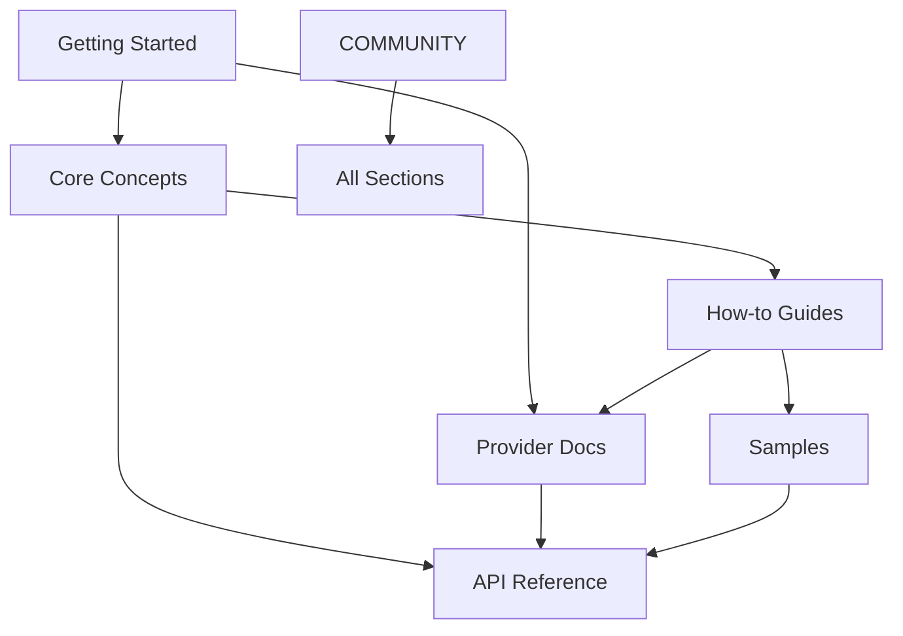

# Information Architecture

## Overview

The information architecture for SimpleMessageBus documentation is designed to support multiple user journeys while maintaining logical organization that reflects both the product's modular structure and users' mental models.

## Design Principles

### 1. Task-Oriented Organization
Structure content around what users want to accomplish rather than internal system organization.

### 2. Progressive Disclosure
Present information in layers, from basic concepts to advanced implementation details.

### 3. Multiple Entry Points
Support different starting points based on user experience level and immediate needs.

### 4. Consistent Navigation Patterns
Use predictable navigation structures across all sections.

## Site Structure

### Primary Navigation

```
Top Navigation:
[SimpleMessageBus Logo] | Docs | API | Samples | Blog | GitHub

Secondary Navigation (Docs):
Getting Started | Guides | Concepts | Providers | API Reference | Community
```

### Hierarchical Structure

```
SimpleMessageBus Documentation
│
├── 🚀 Getting Started
│   ├── Overview
│   ├── Installation
│   ├── Quick Start (5 minutes)
│   ├── Your First Message
│   └── Next Steps
│
├── 📖 Core Concepts
│   ├── Architecture Overview
│   ├── Messages & Envelopes
│   ├── Publishers & Dispatchers
│   ├── Handlers & Processing
│   ├── Queue Providers
│   └── Error Handling
│
├── 🛠️ How-to Guides
│   ├── Choosing a Provider
│   │   ├── Provider Comparison
│   │   ├── Decision Matrix
│   │   └── Migration Paths
│   ├── Message Design Patterns
│   │   ├── Command vs Event Messages
│   │   ├── Message Versioning
│   │   └── Large Message Handling
│   ├── Testing Strategies
│   │   ├── Unit Testing with Breakdance
│   │   ├── Integration Testing
│   │   └── End-to-End Testing
│   ├── Performance Optimization
│   │   ├── Scaling Strategies
│   │   ├── Monitoring & Metrics
│   │   └── Troubleshooting
│   └── Advanced Scenarios
│       ├── Multi-Provider Setup
│       ├── Custom Serialization
│       └── Security Considerations
│
├── 🔌 Provider Documentation
│   ├── Azure Storage Queues
│   │   ├── Setup & Configuration
│   │   ├── WebJobs Integration
│   │   │   ├── Function App Setup
│   │   │   ├── Triggers & Bindings
│   │   │   └── Scaling Configuration
│   │   ├── Performance Tuning
│   │   └── Best Practices
│   ├── File System
│   │   ├── Setup & Configuration
│   │   ├── Cross-Platform Usage
│   │   │   ├── Windows Setup
│   │   │   ├── Linux Setup
│   │   │   └── macOS Setup
│   │   ├── Development Workflow
│   │   └── Production Considerations
│   ├── Amazon SQS
│   │   ├── Setup & Configuration
│   │   ├── IAM & Security
│   │   │   ├── Required Permissions
│   │   │   ├── Security Best Practices
│   │   │   └── Cross-Account Access
│   │   ├── FIFO vs Standard Queues
│   │   └── Cost Optimization
│   └── IndexedDb (Blazor)
│       ├── Setup & Configuration
│       ├── Browser Compatibility
│       ├── Offline Scenarios
│       └── Performance Limits
│
├── 📚 API Reference
│   ├── Core
│   │   ├── Interfaces
│   │   │   ├── IMessage
│   │   │   ├── IMessageHandler<T>
│   │   │   ├── IMetadataAware
│   │   │   └── ITrackable
│   │   ├── Classes
│   │   │   ├── MessageEnvelope
│   │   │   └── MessageBase
│   │   └── Extensions
│   ├── Publishing
│   │   ├── Interfaces
│   │   │   └── IMessagePublisher
│   │   ├── Classes
│   │   │   ├── FileSystemMessagePublisher
│   │   │   ├── AzureStorageQueueMessagePublisher
│   │   │   ├── AmazonSQSMessagePublisher
│   │   │   └── IndexedDbMessagePublisher
│   │   └── Extensions
│   ├── Dispatching
│   │   ├── Interfaces
│   │   │   ├── IMessageDispatcher
│   │   │   └── IQueueProcessor
│   │   ├── Classes
│   │   │   ├── OrderedMessageDispatcher
│   │   │   ├── ParallelMessageDispatcher
│   │   │   └── Provider-Specific Processors
│   │   └── Extensions
│   ├── Configuration
│   │   ├── Options Classes
│   │   │   ├── AzureStorageQueueOptions
│   │   │   ├── FileSystemOptions
│   │   │   ├── AmazonSQSOptions
│   │   │   └── IndexedDbOptions
│   │   └── Extension Methods
│   └── Testing
│       ├── Breakdance
│       │   └── TestableMessagePublisher
│       └── Test Utilities
│
├── 💡 Samples & Tutorials
│   ├── Interactive Examples
│   │   ├── Message Publishing Playground
│   │   ├── Handler Implementation
│   │   └── Configuration Builder
│   ├── Complete Applications
│   │   ├── Console Application
│   │   ├── Azure WebJobs Function
│   │   ├── Blazor WebAssembly App
│   │   └── Microservices Example
│   ├── Code Snippets
│   │   ├── Common Patterns
│   │   ├── Error Handling Examples
│   │   └── Performance Optimizations
│   └── Video Tutorials
│       ├── Getting Started Series
│       ├── Provider Deep Dives
│       └── Advanced Scenarios
│
└── 🤝 Community
    ├── Contributing
    │   ├── Development Setup
    │   ├── Code Guidelines
    │   ├── Testing Requirements
    │   └── Pull Request Process
    ├── Architecture Guide
    │   ├── Project Structure
    │   ├── Design Patterns
    │   ├── Adding Providers
    │   └── Extension Points
    ├── Resources
    │   ├── Roadmap
    │   ├── Changelog
    │   ├── FAQ
    │   └── Support Channels
    └── Documentation Guide
        ├── Writing Guidelines
        ├── Review Process
        └── Style Guide
```

## Content Relationships

### Cross-Reference Strategy



### Link Types

1. **Prerequisite Links** - "Before reading this, you should understand..."
2. **Related Links** - "See also..."
3. **Deep Dive Links** - "For more details..."
4. **Example Links** - "See this in action..."
5. **API Links** - "View API documentation..."

## Navigation Patterns

### Sidebar Navigation

```javascript
// Sidebar structure with progressive disclosure
{
  "docs": [
    {
      "type": "category",
      "label": "🚀 Getting Started",
      "collapsed": false,
      "items": [
        "getting-started/overview",
        "getting-started/installation",
        "getting-started/quick-start",
        "getting-started/first-message",
        "getting-started/next-steps"
      ]
    },
    {
      "type": "category", 
      "label": "📖 Core Concepts",
      "collapsed": true,
      "items": [
        "concepts/architecture",
        "concepts/messages",
        "concepts/publishers",
        "concepts/handlers",
        "concepts/providers",
        "concepts/error-handling"
      ]
    },
    // ... other categories
  ]
}
```

### Breadcrumb Strategy

```
SimpleMessageBus > Providers > Azure Storage Queues > WebJobs Integration > Function App Setup
```

### In-Page Navigation

- **Table of Contents** - Auto-generated from headings
- **Previous/Next** - Context-aware navigation
- **Edit on GitHub** - Community contribution link
- **Feedback** - Page-specific feedback form

## Search Architecture

### Search Categories

1. **Documentation** - Conceptual and how-to content
2. **API Reference** - Types, members, parameters
3. **Code Examples** - Searchable code snippets
4. **Configuration** - Settings and options

### Search Facets

- **Content Type**: Guide, Reference, Example, FAQ
- **Provider**: Azure, FileSystem, Amazon, IndexedDb
- **Difficulty**: Beginner, Intermediate, Advanced
- **Version**: 6.0, 5.0, 4.0

### Search Result Prioritization

1. **Exact matches** in titles
2. **Getting Started** content for new users
3. **Current version** content
4. **Popular pages** based on analytics
5. **Recently updated** content

## Mobile-First Architecture

### Responsive Breakpoints

- **Mobile**: < 768px - Hamburger menu, vertical stack
- **Tablet**: 768px - 1024px - Collapsible sidebar
- **Desktop**: > 1024px - Full sidebar, multi-column layout

### Mobile Navigation

```
[☰] SimpleMessageBus                    [🔍]
────────────────────────────────────────────
Getting Started                          >
Core Concepts                            >
How-to Guides                            >
Providers                                >
API Reference                            >
Community                                >
────────────────────────────────────────────
GitHub | Blog | Support
```

## Content Discovery Strategies

### 1. Role-Based Entry Points

**Landing Page Cards:**
- "New to SimpleMessageBus?" → Getting Started
- "Implementing in production?" → Provider Guides
- "Looking for specific APIs?" → API Reference
- "Contributing to the project?" → Community

### 2. Task-Based Organization

**Common Tasks Section:**
- "Send my first message" → Quick Start
- "Choose a queue provider" → Provider Comparison
- "Handle message failures" → Error Handling Guide
- "Scale my application" → Performance Optimization

### 3. Provider-Specific Paths

**Provider Landing Pages:**
- Azure-specific navigation and examples
- FileSystem development workflow
- Amazon SQS production setup
- Blazor WebAssembly integration

## Information Scent

### Content Labeling Strategy

1. **Descriptive Titles** - Clear, action-oriented
2. **Difficulty Indicators** - Beginner/Intermediate/Advanced
3. **Time Estimates** - "5-minute read", "30-minute tutorial"
4. **Prerequisites** - "Requires .NET 8", "Azure subscription needed"

### Visual Hierarchy

```css
/* Content hierarchy through typography */
.page-title {
  font-size: 2.5rem;
  font-weight: 700;
}

.section-title {
  font-size: 2rem;
  font-weight: 600;
  margin-top: 3rem;
}

.subsection-title {
  font-size: 1.5rem;
  font-weight: 500;
  margin-top: 2rem;
}

.content-type-badge {
  display: inline-block;
  padding: 0.25rem 0.5rem;
  border-radius: 0.25rem;
  font-size: 0.75rem;
  font-weight: 600;
}

.tutorial { background: #e3f2fd; color: #1565c0; }
.guide { background: #f3e5f5; color: #7b1fa2; }
.reference { background: #e8f5e8; color: #2e7d32; }
.example { background: #fff3e0; color: #ef6c00; }
```

## Accessibility Architecture

### Semantic Structure

```html
<!-- Proper heading hierarchy -->
<h1>Provider Documentation</h1>
<nav aria-label="Provider navigation">
  <h2>Azure Storage Queues</h2>
  <h3>Setup & Configuration</h3>
  <h4>Basic Configuration</h4>
</nav>

<!-- Skip navigation -->
<a href="#main-content" class="skip-link">
  Skip to main content
</a>

<!-- Landmarks -->
<main id="main-content" role="main">
<aside role="complementary" aria-label="Table of contents">
<nav role="navigation" aria-label="Breadcrumb">
```

### Focus Management

- Logical tab order through content
- Focus indicators on all interactive elements
- Skip links for keyboard navigation
- Focus restoration after modal interactions

## Internationalization Architecture

### Content Structure for i18n

```
docs/
├── en/                    # English (default)
│   ├── getting-started/
│   └── guides/
├── es/                    # Spanish
│   ├── getting-started/
│   └── guides/
└── locale-config.json     # Language configuration
```

### Translation Strategy

1. **Phase 1**: Core getting started content
2. **Phase 2**: Provider documentation
3. **Phase 3**: Complete API reference
4. **Phase 4**: Community and advanced content

## Performance Architecture

### Content Loading Strategy

1. **Critical Path**: Above-fold content loads first
2. **Progressive Enhancement**: Enhanced features load after core content
3. **Lazy Loading**: Below-fold images and interactive components
4. **Preloading**: Next likely pages based on user journey

### Bundle Optimization

```javascript
// Code splitting by content type
const GettingStarted = lazy(() => import('./pages/GettingStarted'));
const ApiReference = lazy(() => import('./pages/ApiReference'));
const InteractiveExample = lazy(() => import('./components/InteractiveExample'));

// Route-based splitting
export const routes = [
  {
    path: '/docs/getting-started/*',
    component: GettingStarted,
    preload: true
  },
  {
    path: '/api/*',
    component: ApiReference,
    preload: false
  }
];
```

This information architecture provides a solid foundation for intuitive navigation while supporting the diverse needs of SimpleMessageBus users across all experience levels.