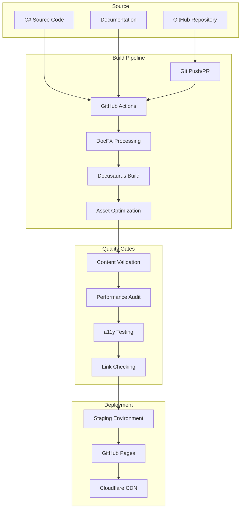

# Deployment and Hosting Strategy

This section outlines the deployment and hosting strategy for the SimpleMessageBus documentation site, including platform evaluation, CI/CD pipeline design, performance optimization, and operational considerations.

## Strategy Overview

The deployment strategy focuses on:
- **Zero-cost hosting** leveraging open source project benefits
- **High performance** with global CDN distribution  
- **Automated deployment** with quality gates
- **Scalable architecture** that grows with the project
- **Reliable operation** with monitoring and backup

## Hosting Platform Analysis

### Primary Recommendation: GitHub Pages

**Why GitHub Pages:**
- **Free hosting** for open source projects
- **Tight integration** with GitHub repository
- **Custom domain support** with SSL
- **Global CDN** via GitHub's infrastructure
- **Simple deployment** via GitHub Actions
- **Version control** for all changes

**Configuration:**
```yaml
# Repository: CloudNimble/SimpleMessageBus
# GitHub Pages Settings:
Source: GitHub Actions
Custom Domain: docs.simplemessagebus.com
Enforce HTTPS: Enabled
```

### Alternative Options Evaluated

#### 1. Azure Static Web Apps
**Pros:**
- Excellent performance and scaling
- Built-in Azure DevOps integration
- Free tier available
- Advanced staging environments

**Cons:**
- Microsoft-specific (vendor lock-in)
- More complex setup
- Overkill for documentation site

**Verdict:** Good option but GitHub Pages is simpler

#### 2. Netlify
**Pros:**
- Excellent developer experience
- Built-in forms and analytics
- Branch preview deployments
- Edge functions support

**Cons:**
- Commercial platform with usage limits
- Less tight GitHub integration
- Unnecessary features for docs

**Verdict:** Excellent platform but commercial nature is drawback

#### 3. Vercel
**Pros:**
- Optimized for React/Next.js
- Excellent performance
- Preview deployments
- Edge computing capabilities

**Cons:**
- Commercial platform
- Focused on web applications
- Usage-based pricing

**Verdict:** Great for apps, overkill for documentation

## Deployment Architecture

### High-Level Flow



## CI/CD Pipeline Implementation

### GitHub Actions Workflow

```yaml
# .github/workflows/deploy-docs.yml
name: Deploy Documentation

on:
  push:
    branches: [main, v6]
    paths:
      - 'src/**/*.cs'
      - 'docs/**/*'
      - '.github/workflows/deploy-docs.yml'
  pull_request:
    branches: [main]
    paths:
      - 'src/**/*.cs' 
      - 'docs/**/*'

permissions:
  contents: read
  pages: write
  id-token: write

concurrency:
  group: "pages"
  cancel-in-progress: false

jobs:
  build:
    runs-on: ubuntu-latest
    
    steps:
    - name: Checkout
      uses: actions/checkout@v4
      with:
        fetch-depth: 0
        
    - name: Setup .NET
      uses: actions/setup-dotnet@v3
      with:
        dotnet-version: '8.0.x'
        
    - name: Setup Node.js
      uses: actions/setup-node@v4
      with:
        node-version: '18'
        cache: 'npm'
        cache-dependency-path: docs/package-lock.json
        
    - name: Setup Pages
      uses: actions/configure-pages@v4
      
    - name: Restore .NET dependencies
      run: dotnet restore
      
    - name: Build .NET projects
      run: dotnet build --no-restore --configuration Release
      
    - name: Install DocFX
      run: |
        dotnet tool install -g docfx
        
    - name: Generate API documentation
      run: |
        cd docs
        docfx metadata docfx.json --warningsAsErrors
        
    - name: Install npm dependencies
      run: |
        cd docs
        npm ci
        
    - name: Transform API metadata
      run: |
        cd docs
        npm run transform-api
        
    - name: Validate content
      run: |
        cd docs
        npm run validate-content
        
    - name: Build documentation site
      run: |
        cd docs
        npm run build
        
    - name: Run Lighthouse audit
      uses: treosh/lighthouse-ci-action@v10
      with:
        configPath: './docs/lighthouserc.json'
        uploadArtifacts: true
        temporaryPublicStorage: true
        
    - name: Check accessibility
      run: |
        cd docs
        npm run test:a11y
        
    - name: Validate links
      run: |
        cd docs
        npm run validate-links
        
    - name: Upload artifact
      uses: actions/upload-pages-artifact@v3
      with:
        path: docs/build
        
  deploy:
    if: github.ref == 'refs/heads/main'
    environment:
      name: github-pages
      url: ${{ steps.deployment.outputs.page_url }}
    runs-on: ubuntu-latest
    needs: build
    
    steps:
    - name: Deploy to GitHub Pages
      id: deployment
      uses: actions/deploy-pages@v4
      
    - name: Update search index
      run: |
        curl -X POST \
          -H "Content-Type: application/json" \
          -H "Authorization: Bearer ${{ secrets.ALGOLIA_API_KEY }}" \
          -d '{"indexName": "simplemessagebus"}' \
          https://api.algolia.com/1/indexes/simplemessagebus/clear
          
        curl -X POST \
          "https://crawler.algolia.com/api/1/crawlers/${{ secrets.ALGOLIA_CRAWLER_ID }}/reindex" \
          -H "Authorization: Bearer ${{ secrets.ALGOLIA_API_KEY }}"
          
    - name: Notify deployment
      uses: 8398a7/action-slack@v3
      with:
        status: ${{ job.status }}
        channel: '#docs'
        webhook_url: ${{ secrets.SLACK_WEBHOOK }}
      if: always()
```

### Quality Gate Configuration

```javascript
// docs/scripts/quality-gates.js
const lighthouse = require('lighthouse');
const chromeLauncher = require('chrome-launcher');
const pa11y = require('pa11y');
const linkChecker = require('broken-link-checker');

async function runQualityGates() {
  console.log('🚀 Running quality gates...');
  
  const results = {
    performance: await testPerformance(),
    accessibility: await testAccessibility(),
    links: await validateLinks(),
    content: await validateContent()
  };
  
  const failures = [];
  
  // Performance gate
  if (results.performance.score < 90) {
    failures.push(`Performance score: ${results.performance.score} (required: 90+)`);
  }
  
  // Accessibility gate
  if (results.accessibility.violations.length > 0) {
    failures.push(`Accessibility violations: ${results.accessibility.violations.length}`);
  }
  
  // Link validation gate
  if (results.links.broken.length > 0) {
    failures.push(`Broken links: ${results.links.broken.length}`);
  }
  
  // Content validation gate
  if (results.content.errors.length > 0) {
    failures.push(`Content errors: ${results.content.errors.length}`);
  }
  
  if (failures.length > 0) {
    console.error('❌ Quality gates failed:');
    failures.forEach(failure => console.error(`  - ${failure}`));
    process.exit(1);
  }
  
  console.log('✅ All quality gates passed!');
}

async function testPerformance() {
  const chrome = await chromeLauncher.launch({chromeFlags: ['--headless']});
  const options = {
    logLevel: 'info',
    output: 'json',
    onlyCategories: ['performance'],
    port: chrome.port,
  };
  
  const runnerResult = await lighthouse('http://localhost:3000', options);
  await chrome.kill();
  
  return {
    score: runnerResult.lhr.categories.performance.score * 100
  };
}

async function testAccessibility() {
  const results = await pa11y('http://localhost:3000', {
    standard: 'WCAG2AA',
    includeNotices: false,
    includeWarnings: false
  });
  
  return {
    violations: results.issues || []
  };
}

module.exports = { runQualityGates };
```

## Performance Optimization

### CDN Configuration (Cloudflare)

```javascript
// docs/cloudflare-config.js
const cloudflareConfig = {
  // DNS Settings
  dns: {
    name: 'docs.simplemessagebus.com',
    type: 'CNAME',
    content: 'cloudnimble.github.io',
    ttl: 300,
    proxied: true
  },
  
  // Page Rules
  pageRules: [
    {
      targets: ['docs.simplemessagebus.com/api/*'],
      actions: {
        cacheLevel: 'cache_everything',
        edgeCacheTtl: 86400, // 24 hours
        browserCacheTtl: 3600 // 1 hour
      }
    },
    {
      targets: ['docs.simplemessagebus.com/assets/*'],
      actions: {
        cacheLevel: 'cache_everything',
        edgeCacheTtl: 2592000, // 30 days
        browserCacheTtl: 604800 // 7 days
      }
    }
  ],
  
  // Security Settings
  security: {
    securityLevel: 'medium',
    ssl: 'full',
    alwaysUseHttps: true,
    minTlsVersion: '1.2',
    hsts: {
      enabled: true,
      maxAge: 31536000,
      includeSubdomains: true,
      preload: true
    }
  },
  
  // Performance Settings
  performance: {
    minify: {
      css: true,
      js: true,
      html: true
    },
    brotli: true,
    http2: true,
    http3: true,
    earlyHints: true
  }
};
```

### Asset Optimization

```javascript
// docs/scripts/optimize-assets.js
const imagemin = require('imagemin');
const imageminPngquant = require('imagemin-pngquant');
const imageminMozjpeg = require('imagemin-mozjpeg');
const imageminSvgo = require('imagemin-svgo');
const imageminWebp = require('imagemin-webp');

async function optimizeImages() {
  await imagemin(['build/assets/images/*.{jpg,png,svg}'], {
    destination: 'build/assets/images/optimized',
    plugins: [
      imageminMozjpeg({quality: 85}),
      imageminPngquant({quality: [0.65, 0.8]}),
      imageminSvgo({
        plugins: [
          {removeViewBox: false},
          {cleanupIDs: false}
        ]
      })
    ]
  });
  
  // Generate WebP versions
  await imagemin(['build/assets/images/*.{jpg,png}'], {
    destination: 'build/assets/images/webp',
    plugins: [
      imageminWebp({quality: 85})
    ]
  });
}

async function optimizeCSS() {
  const cssnano = require('cssnano');
  const postcss = require('postcss');
  const fs = require('fs').promises;
  
  const cssFiles = await glob('build/assets/css/*.css');
  
  for (const file of cssFiles) {
    const css = await fs.readFile(file, 'utf8');
    const result = await postcss([cssnano()]).process(css, {from: file});
    await fs.writeFile(file, result.css);
  }
}

module.exports = { optimizeImages, optimizeCSS };
```

## Environment Management

### Environment Configuration

```javascript
// docs/config/environments.js
const environments = {
  development: {
    baseUrl: 'http://localhost:3000',
    apiUrl: 'http://localhost:3001/api',
    analytics: {
      googleAnalytics: 'UA-DEV-123456',
      hotjar: false
    },
    search: {
      algolia: {
        appId: 'DEV123',
        apiKey: 'dev-api-key',
        indexName: 'simplemessagebus-dev'
      }
    },
    cdn: {
      enabled: false
    }
  },
  
  staging: {
    baseUrl: 'https://staging-docs.simplemessagebus.com',
    apiUrl: 'https://staging-api.simplemessagebus.com',
    analytics: {
      googleAnalytics: 'UA-STAGING-123456',
      hotjar: false
    },
    search: {
      algolia: {
        appId: 'STAGING123',
        apiKey: 'staging-api-key',
        indexName: 'simplemessagebus-staging'
      }
    },
    cdn: {
      enabled: true,
      provider: 'cloudflare'
    }
  },
  
  production: {
    baseUrl: 'https://docs.simplemessagebus.com',
    apiUrl: 'https://api.simplemessagebus.com',
    analytics: {
      googleAnalytics: process.env.GA_TRACKING_ID,
      hotjar: process.env.HOTJAR_ID
    },
    search: {
      algolia: {
        appId: process.env.ALGOLIA_APP_ID,
        apiKey: process.env.ALGOLIA_API_KEY,
        indexName: 'simplemessagebus'
      }
    },
    cdn: {
      enabled: true,
      provider: 'cloudflare'
    }
  }
};

module.exports = environments;
```

### Branch-Based Deployments

```yaml
# .github/workflows/staging.yml
name: Deploy to Staging

on:
  push:
    branches: [develop, feature/*]
  pull_request:
    branches: [main]

jobs:
  deploy-staging:
    runs-on: ubuntu-latest
    environment: staging
    
    steps:
    - uses: actions/checkout@v4
    
    - name: Build documentation
      run: |
        cd docs
        npm ci
        npm run build:staging
        
    - name: Deploy to staging
      uses: peaceiris/actions-gh-pages@v3
      with:
        github_token: ${{ secrets.GITHUB_TOKEN }}
        publish_dir: docs/build
        destination_dir: staging/${{ github.head_ref || github.ref_name }}
        
    - name: Comment PR with staging URL
      if: github.event_name == 'pull_request'
      uses: actions/github-script@v6
      with:
        script: |
          github.rest.issues.createComment({
            issue_number: context.issue.number,
            owner: context.repo.owner,
            repo: context.repo.repo,
            body: '📖 Staging deployment available at: https://docs.simplemessagebus.com/staging/${{ github.head_ref }}'
          })
```

## Monitoring and Operations

### Uptime Monitoring

```javascript
// monitoring/uptime-check.js
const fetch = require('node-fetch');
const { IncomingWebhook } = require('@slack/webhook');

const webhook = new IncomingWebhook(process.env.SLACK_WEBHOOK_URL);

async function checkUptime() {
  const endpoints = [
    'https://docs.simplemessagebus.com',
    'https://docs.simplemessagebus.com/api',
    'https://docs.simplemessagebus.com/docs/getting-started'
  ];
  
  for (const endpoint of endpoints) {
    try {
      const response = await fetch(endpoint, { timeout: 10000 });
      
      if (!response.ok) {
        await webhook.send({
          text: `🚨 Site is down: ${endpoint} returned ${response.status}`,
          channel: '#alerts'
        });
      }
    } catch (error) {
      await webhook.send({
        text: `🚨 Site is unreachable: ${endpoint} - ${error.message}`,
        channel: '#alerts'
      });
    }
  }
}

// Run every 5 minutes
setInterval(checkUptime, 5 * 60 * 1000);
```

### Performance Monitoring

```javascript
// monitoring/performance-monitor.js
const lighthouse = require('lighthouse');
const chromeLauncher = require('chrome-launcher');

async function monitorPerformance() {
  const chrome = await chromeLauncher.launch({chromeFlags: ['--headless']});
  
  const options = {
    logLevel: 'info',
    output: 'json',
    port: chrome.port,
  };
  
  const runnerResult = await lighthouse('https://docs.simplemessagebus.com', options);
  await chrome.kill();
  
  const scores = {
    performance: runnerResult.lhr.categories.performance.score * 100,
    accessibility: runnerResult.lhr.categories.accessibility.score * 100,
    bestPractices: runnerResult.lhr.categories['best-practices'].score * 100,
    seo: runnerResult.lhr.categories.seo.score * 100
  };
  
  // Alert if any score drops below threshold
  for (const [category, score] of Object.entries(scores)) {
    if (score < 90) {
      await webhook.send({
        text: `⚠️ Performance alert: ${category} score dropped to ${score}`,
        channel: '#performance'
      });
    }
  }
  
  // Store metrics for trending
  await storeMetrics(scores);
}

// Run daily
setInterval(monitorPerformance, 24 * 60 * 60 * 1000);
```

## Backup and Recovery

### Content Backup Strategy

```yaml
# .github/workflows/backup.yml
name: Backup Documentation

on:
  schedule:
    - cron: '0 2 * * *'  # Daily at 2 AM UTC
  workflow_dispatch:

jobs:
  backup:
    runs-on: ubuntu-latest
    
    steps:
    - name: Checkout
      uses: actions/checkout@v4
      with:
        fetch-depth: 0
        
    - name: Create backup archive
      run: |
        tar -czf docs-backup-$(date +%Y%m%d).tar.gz docs/
        
    - name: Upload to backup storage
      uses: actions/upload-artifact@v3
      with:
        name: docs-backup-$(date +%Y%m%d)
        path: docs-backup-*.tar.gz
        retention-days: 90
        
    - name: Sync to external backup
      run: |
        # Sync to external storage (S3, etc.)
        aws s3 cp docs-backup-$(date +%Y%m%d).tar.gz \
          s3://simplemessagebus-backups/docs/
      env:
        AWS_ACCESS_KEY_ID: ${{ secrets.BACKUP_AWS_ACCESS_KEY }}
        AWS_SECRET_ACCESS_KEY: ${{ secrets.BACKUP_AWS_SECRET_KEY }}
```

### Disaster Recovery Plan

**Recovery Time Objectives:**
- **Critical outage**: 30 minutes
- **Data corruption**: 2 hours  
- **Complete site rebuild**: 4 hours

**Recovery Procedures:**

1. **Site Outage (GitHub Pages down)**
   - Deploy to backup hosting (Netlify/Vercel)
   - Update DNS to point to backup
   - Estimated recovery: 30 minutes

2. **Repository Corruption**
   - Restore from Git backup
   - Rebuild from latest backup archive
   - Estimated recovery: 2 hours

3. **Complete Infrastructure Loss**
   - Rebuild from external backups
   - Reconfigure all services
   - Estimated recovery: 4 hours

## Security Considerations

### Content Security Policy

```javascript
// docs/security/csp.js
const contentSecurityPolicy = {
  "default-src": ["'self'"],
  "script-src": [
    "'self'",
    "'unsafe-inline'", // Required for Docusaurus
    "www.googletagmanager.com",
    "www.google-analytics.com",
    "cdn.jsdelivr.net"
  ],
  "style-src": [
    "'self'",
    "'unsafe-inline'", // Required for dynamic styles
    "fonts.googleapis.com"
  ],
  "img-src": [
    "'self'",
    "data:",
    "www.google-analytics.com",
    "github.com"
  ],
  "font-src": [
    "'self'",
    "fonts.gstatic.com"
  ],
  "connect-src": [
    "'self'",
    "*.algolia.net",
    "www.google-analytics.com"
  ],
  "frame-ancestors": ["'none'"],
  "base-uri": ["'self'"],
  "form-action": ["'self'"]
};
```

### Dependency Security

```yaml
# .github/workflows/security.yml
name: Security Audit

on:
  schedule:
    - cron: '0 6 * * 1'  # Weekly on Monday
  workflow_dispatch:

jobs:
  audit:
    runs-on: ubuntu-latest
    
    steps:
    - uses: actions/checkout@v4
    
    - name: Setup Node.js
      uses: actions/setup-node@v4
      with:
        node-version: '18'
        
    - name: Run npm audit
      run: |
        cd docs
        npm audit --audit-level=moderate
        
    - name: Run Snyk security scan
      uses: snyk/actions/node@master
      env:
        SNYK_TOKEN: ${{ secrets.SNYK_TOKEN }}
      with:
        args: --severity-threshold=medium
```

This deployment and hosting strategy provides a robust, scalable, and cost-effective foundation for the SimpleMessageBus documentation site while maintaining high performance and reliability standards.